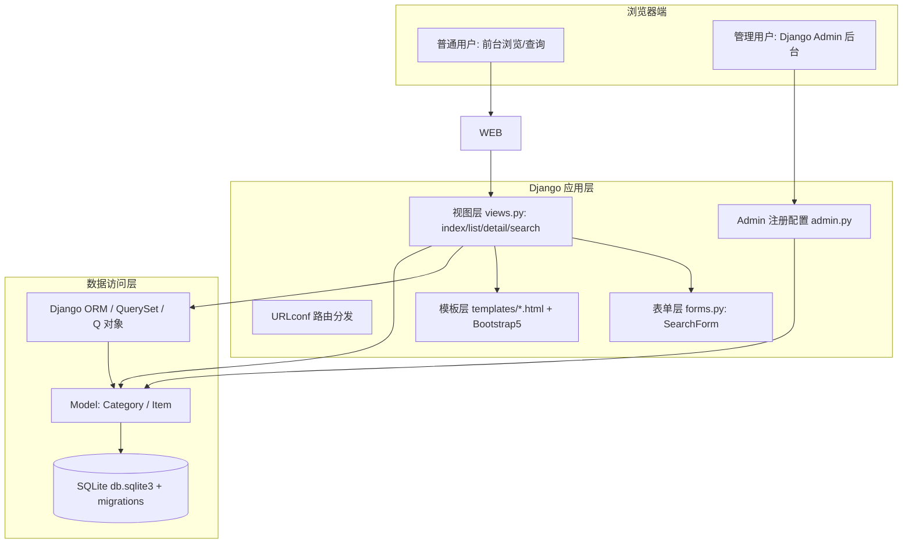
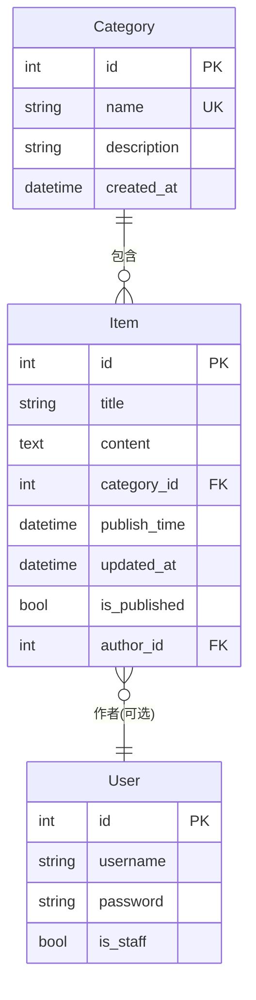
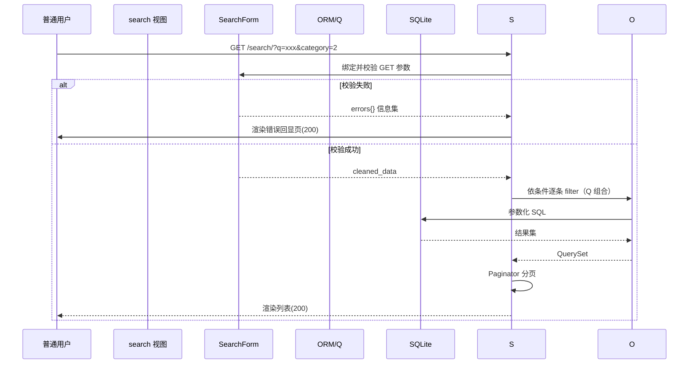

# 基于 Python/Django 的 CMS 原型系统 — 详细设计文档

| 项目名称 | 基于 Python/Django 的 CMS 原型系统 |
| --- | --- |
| 文档编号 | CMS-DES-001 |
| 文档版本 | V1.0 |
| 编写日期 | 2026-08-08 |
| 编写人 | （姓名/学号占位） |
| 输入文档 | 《需求分析文档》CMS-REQ-001 V1.0 |

---

## 0. 修订记录

| 版本 | 日期 | 修订说明 |
| --- | --- | --- |
| V0.1 | 2026-08-08 | 初稿 |
| V1.0 | 2026-08-08 | 评审通过，交付编码阶段 |

## 1. 设计目的与范围

本文档将《需求分析文档》转化为**可实现、可测试、可验证**的详细设计，回答"系统如何组织、数据如何存储与流转、模块如何划分、接口长什么样"四个问题。范围覆盖：

- 总体架构与分层
- 目录与模块划分（含每个文件的职责）
- 数据库逻辑设计与物理设计
- 类/接口级设计（模型、表单、视图、Admin、工具）
- 前台查询的完整实现方案（三种模式 + 组合 + 分页）
- 安全、权限、异常处理设计
- 关键流程（时序）
- 关键设计取舍（含论证）
- 与测试的映射（支撑 V 模型右臂集成测试）

## 2. 总体设计原则

| 原则 | 落地方式 |
| --- | --- |
| 分层职责单一（SRP） | 表现层就是（模板）/ 业务逻辑（视图）/ 数据（模型&ORM）严格分层 |
| 约定优于配置 | 复用 Django 约定：MTV、URL 命名、Admin 自动发现 |
| 数据完整性优先 | 外键删除策略用 **PROTECT**（有文章的栏目禁删，需求 FR-CAT-03；裁决 D-3'，见技术报告 §6.1） |
| 防错优先 | 输入边界全部在表单层拦截，视图层不做裸 try/except 掩盖 |
| 可解释可维护 | Facebook 式：每个模块独立文件、中文注释、命名即文档 |

## 3. 总体架构设计（对应需求 2.4）

### 3.1 架构视图（Mermaid 3 层图）



### 3.2 技术选型定稿（与需求 2.4 一致）

| 组件 | 定稿方案 | 版本约束 |
| --- | --- | --- |
| 语言 | Python | ≥ 3.12（本设计按 3.13 编写） |
| 框架 | Django | 5.2 LTS |
| 数据库 | SQLite | 内置；预留 MySQL 切换配置（settings 注释段） |
| 后端渲染 | Django 模板 + 内置过滤器 | — |
| CSS 框架 | Bootstrap 5 | CDN 引入，离线可改本地 static |
| 测试 | django.test.TestCase（标准库） | pytest-django 可选增强 |
| 规范化 | Ruff（lint + format） | 替代 flake8/black/isort 组合 |
| 认证与权限 | django.contrib.auth + Admin | is_staff 判定 |

### 3.3 数据流转（一次查询请求的完整流转）

```
浏览器 GET /search/?q=Python&start=2024-01-01&category=2
  → urls.py 命中选择 search 视图
  → SearchForm 绑定 GET 数据并校验（时间格式、长度）
  → 校验通过 → Q 对象动态拼接（AND）构造 QuerySet
  → ORM 生成参数化 SQL → SQLite 执行
  → 结果集交给 Paginator 分页
  → 模板渲染（保留查询参数回显）→ HTTP 200
```

---

## 4. 模块划分与目录结构

```
cms_site/                        # 项目根（Git 仓库根）
├── manage.py                    # Django 管理入口
├── requirements.txt             # 依赖清单（可复现部署）
├── .gitignore                   # 忽略 .venv/db.sqlite3/__pycache__
├── README.md                    # 项目说明 + 快速开始
├── config/                      # 项目配置包（原 cms_config）
│   ├── __init__.py
│   ├── settings.py              # 全局配置（含中文化、时区）
│   ├── urls.py                  # 项目级路由（挂载 content 应用）
│   ├── wsgi.py / asgi.py        # 部署入口（Waitress/Gunicorn）
├── content/                     # 业务应用
│   ├── models.py                # Category / Item 模型定义
│   ├── admin.py                 # Admin 注册与列配置
│   ├── forms.py                 # SearchForm（查询表单校验）
│   ├── views.py                 # 视图函数（index/list/detail/search）
│   ├── urls.py                  # 应用级路由
│   ├── tests/
│   │   ├── test_models.py       # 模型单元测试
│   │   ├── test_forms.py        # 表单校验单元测试
│   │   ├── test_views.py        # 集成测试（Client 全流程）
│   │   └── test_security.py     # 安全与权限用例测试
│   ├── management/commands/
│   │   └── seed_data.py         # 演示数据生成命令
│   └── fixtures/demo.json       # 可加载演示数据（备选）
├── templates/
│   ├── base.html                # 基模板（导航+页脚+搜索框）
│   ├── index.html               # 首页（栏目导航+最新文章）
│   ├── item_list.html           # 栏目文章列表/查询结果列表
│   ├── item_detail.html         # 文章详情
│   └── search_form.html         # 查询表单组件（含三条件+回显）
├── static/css/                  # Bootstrap 本地化（可选）
└── docs/                        # 交付文档（本文档所在）
```

**模块职责表**

| 模块/文件 | 职责 | 依赖 |
| --- | --- | --- |
| content/models.py | 定义实体与数据约束、业务辅助方法 | django.db |
| content/forms.py | SearchForm：GET 查询参数校验（日期格式/顺序/长度） | django.forms |
| content/views.py | 事件处理编排：查询组织、分页、异常分流 | forms+models |
| content/urls.py | 应用路由表（命名路由 name=） | views |
| content/admin.py | 后台列表/过滤/搜索配置（满足管理端大多数场景） | models |
| config/settings.py | 安装、语言时区、数据库、静态/媒体、安全项 | Django 全局 |
| templates/* | 表现层渲染；变量仅来自视图上下文 | 模板引擎 |
| tests/ | 单元+集成+安全测试（V 模型右臂） | django.test |

---

## 5. 数据库设计（详细设计）

### 5.1 ER 图



### 5.2 Category 表

| 字段名 | 类型 | 约束 | 说明 |
| --- | --- | --- | --- |
| id | AutoField | PK | 自增主键 |
| name | CharField(50) | NOT NULL, UNIQUE | 栏目名称（唯一） |
| description | TextField | NULL 允许 | 栏目简介（可选） |
| created_at | DateTimeField | auto_now_add | 建立时间 |

**方法**：`def __str__` 返回 name；`article_count`（property 或 annotate）供列表显示文章数。

### 5.3 Item 表

| 字段名 | 类型 | 约束 | 说明 |
| --- | --- | --- | --- |
| id | AutoField | PK | 主键 |
| title | CharField(200) | 必填（表单强制） | 文章题目（按题目查询目标字段） |
| content | TextField | 必填（允许空串见设计取舍 D-06） | 正文 |
| category | FK(Category) | **on_delete=PROTECT** | 所属栏目（按栏目查询目标字段；裁决 D-3' 对齐 ProtectedError 捕获与 T-MD-04） |
| publish_time | DateTimeField | default=timezone.now, db_index | 发表时间（按时间查询目标字段，已建索引） |
| updated_at | DateTimeField | auto_now | 最后修改时间 |
| is_published | BooleanField | default=True | 发布/草稿开关（FR-ART-05 扩展） |
| author | FK(User) | null=True, on_delete=SET_NULL | 作者（可选显示） |

**Meta**：`ordering = ["-publish_time"]`、`indexes`（publish_time）、`verbose_name="文章"`。

### 5.4 索引与查询性能设计

- `publish_time` 建 `db_index=True` → 按时间范围查询走索引；
- 题目模糊查询 `title__icontains` 在原型规模（≤10 万行）下为线性扫描可接受；如需全文检索（可选扩展 WOULD）再引入 SQLite FTS5，不改变模型。

### 5.5 演示数据设计（FR-DEMO-01 的数据蓝图）

| 栏目（5 个） | 文章数 | 时间分布 | 标题关键词（便于查询演示） |
| --- | --- | --- | --- |
| 通知公告 | 15 | 2023—2026 | "…通知""…公告" |
| 教学动态 | 12 | 2024—2026 | "Python""课程""考试" |
| 科研进展 | 14 | 2025—2026 | "论文""基金""获奖" |
| 学生活动 | 12 | 2023—2026 | "比赛""讲座" |
| 失物招领（干栏目演示） | 10 | 2026 | 便于测试栏目过滤 |

seed 命令使用 `random` 种子固定（可复现），并打印统计信息。

---

## 6. 表单设计（详细规则）

### 6.1 SearchForm（查询表单，核心校验单元）

| 字段 | 类型 | 校验规则 | 清洗后转换 |
| --- | --- | --- | --- |
| q | CharField(required=False) | max_length=100；前后剔除空格 | str（可为空） |
| start | DateField(required=False) | 输入格式 `%Y-%m-%d`；非法 → 校验错误 | date 或 None |
| end | DateField(required=False) | 同上 | date 或 None |
| category | ChoiceField(required=False) | 选项来自 Category 全集；非法 id → 校验错误 | int 或 None |

**表单级 clean()**：若 start 与 end 同时非空且 `start > end` → 报错"开始日期不能晚于结束日期"（NFR-01 示例场景）。

**错误呈现**：错误信息以列表形式随表单回显（模板中 `{{ form.start.errors }}`），不走到 500。

### 6.2 Admin 表单（Django 托管）

- 文章表单字段顺序：title → category → content → is_published → publish_time；
- `list_filter = ("is_published", "category", "publish_time")`、`search_fields = ("title",)`、`date_hierarchy = "publish_time"`——后台自带三种查询样式（与前台对应，可作为功能演示素材）。

---

## 7. 视图层详细设计（接口设计）

### 7.1 路由表

| 路由模式 | 视图函数 | 参数 | 功能 | 权限 | 需求映射 |
| --- | --- | --- | --- | --- | --- |
| `/` | `index` | — | 首页：栏目导航 + 最新 8 篇 | 公开 | FR-UI-01 |
| `/list/` | `item_list` | `category`（GET 查询参数，可空） | 栏目文章列表（分页；裁决 D-02 统一查询参数形式，与 search 共用表单回显） | 公开 | FR-UI-02 |
| `/item/<int:pk>/` | `item_detail` | pk | 文章详情 | 公开 | FR-UI-03 |
| `/search/` | `search` | q/start/end/category（GET） | 三种模式+组合查询（分页） | 公开 | FR-SRCH-01~04,FR-PAGE-01 |
| `/admin/` | Django Admin | — | 栏目/文章 CRUD | is_staff | FR-CAT/ART |

> 设计取舍：前台使用 FBV（函数视图）+ 装饰器，讲解成本低、每行可控；Admin 承担管理端 CRUD（FR-ART-04 后台列表的过滤/搜索由 Admin 原生能力覆盖）。

### 7.2 视图详设（伪代码级）

**search(request)** —— 查询核心（三种模式组合逻辑）

```
def search(request):
    form = SearchForm(request.GET)              # 绑定并校验
    if form.is_valid():
        qs = Item.objects.filter(is_published=true)   # 基础过滤：仅已发布
        if q:  qs = qs.filter(title__icontains=q)     # 模式 1
        if start: qs = qs.filter(publish_time__gte=start)      # 模式 2
        if end:  qs = qs.filter(publish_time__lte=end)
        if cat:  qs = qs.filter(category_id=cat)               # 模式 3
        qs = qs.select_related("category")          # 减少 N+1
    else:
        qs = Item.objects.none()                  # 校验失败不查库、不崩溃
    page = request.GET.get("page", 1)
    try:
        items = paginator.page(page)             # Paginator(page_obj)
    except PageNotAnInteger: items = paginator.page(1)
    except EmptyPage:        items = paginator.page(paginator.num_pages)
    context = {"form": form, "items": items, ...}
    return render(request, "content/item_list.html", context)
```

要点：
1. **防注入**：`icontains`/`gte`/`lte` 全部走 ORM 参数化绑定，无字符串拼接；
2. **异常隔离**：非法日期被表单拦截 → `form.is_valid()` 为 False → 展示错误，而非 500；
3. **组合逻辑**：用"逐个 append filter"自然实现 AND 组合——四种参数任意组合均正确；
4. **分页守卫**：`page` 参数三种异常（非整数/超界/空）全部降级处理。

**item_detail**：`get_object_or_404(Item, pk=pk, is_published=True)`（草稿对普通用户视同 404）→ 模板渲染。

**index**：`Category.objects.annotate(count=Count("item"))` 供首页导航显示各部文章数；`Item.objects.filter(is_published=True)[:8]` 最新文章。

---

## 8. 管理后台设计（Admin）

| 配置对象 | 说明 |
| --- | --- |
| CategoryAdmin | `list_display=("name","article_count","created_at")`；`search_fields=("name",)` |
| ItemAdmin | `list_display=("title","category","publish_time","is_published")`；`list_filter`、`search_fields`、`date_hierarchy`（见 6.2） |
| 权限 | 仅 `is_staff` 可登录后台；超级用户：`createsuperuser` 创建默认账号（部署说明记录 `admin/admin123456` 属示例，生产建议强密码） |
| 扩展 | Pubish 快捷 Action：`mark_published` / `mark_draft`（单/多选批量）—— 加分项 |

---

## 9. 模板设计

| 模板 | 关键区块 | 变量 |
| --- | --- | --- |
| base.html | 顶部导航（栏目下拉 + 搜索入口）、页脚、Bootstrap 引入 | `categories`（导航） |
| index.html | 栏目标签卡 + `items|slice` 列表 | `categories, latest_items` |
| item_list.html | 搜索表单（回显 `{{ form }}`）、结果表、分页组件 | `form, items, page_obj` |
| item_detail.html | 面包屑（栏目→文章）、正文 | `item`（含 `category`） |
| 分页组件 | 「上一页/下一页/页码 + 总页数」 | `page_obj` 各属性 |

模板安全性：Django 模板默认 **autoescape 开启**，`{{ item.content }}` 自动转义 → 满足 NFR-02 XSS 项。正文若后续引入富文本，需要改用安全过滤器（并在安全设计中记录风险迁移）。

设计取舍 D-05：不引入前端框架（Vue/React），内容站点以服务端渲染为准，查询交互由整页 GET 提交 + 回显完成——简单可测，符合"原型"定位。

---

## 10. 安全设计

| 威胁 | 防御措施 | 对应需求 |
| --- | --- | --- |
| SQL 注入 | ORM 参数化查询；禁用手写 SQL | NFR-02 |
| XSS | 模板 autoescape（默认开启）；不用 `|safe` 滤镜 | NFR-02 |
| CSRF | Django CSRF 中间件（默认开启）；POST 表单带 `` | NFR-02 |
| 越权 | 管理 URL 仅 Admin（`is_staff`）可访问；前台视图片 `is_published` 过滤 | NFR-02, FR-ART-05 |
| 会话安全 | `SESSION_COOKIE_HTTPONLY`、`SESSION_COOKIE_SAMESITE=Lax`（settings 显式配置） | NFR-02 |
| 密码 | 内置 PBKDF2 哈希（默认） | NFR-02 |
| 生产配置 | `DEBUG=False`、SECRET_KEY 从环境变量读取（`os.environ.get`）、`ALLOWED_HOSTS` 显式配置 | NFR-02 / NFR-06 |

---

## 11. 异常与错误处理设计

| 场景 | 处理策略（视图层） | 用户所见 | 深层防线 |
| --- | --- | --- | --- |
| 非法日期/字段 | SearchForm 校验失败 → 错误信息回显 | 表单页 + 错误提示 | 无 |
| 页码越界/非整数 | PageNotAnInteger → 第 1 页；EmptyPage → 末页 | 正常页 | — |
| pk 不存在 | `get_object_or_404` | 404 页 | — |
| 删除有文章的栏目 | `models.ProtectedError` → 捕获后回 Admin 页并 message 提示 | 提示"该栏目下存在文章，无法删除" | DB 层 PROTECT 兜底 |
| 数据库整体不可用 | 不捕获（保持可见性） → Django 500 | 500 页 | 日志记录 |
| 防御性编程 | 视图不做裸 try/except 吞异常；业务异常显式捕获 | 可追踪 | 日志 |

---

## 12. 关键时序图（发布与查询）

**查询时序（右侧为测试关注点）**



---

## 13. 缓存、日志与部署（简要）

| 主题 | 设计 |
| --- | --- |
| 日志 | `config.settings` 配置 `LOGGING`：文件日志（info）+ 控制台（debug，生产切换 warning） |
| 静态文件 | `STATIC_URL=/static/`；部署时 `collectstatic` 到 `STATIC_ROOT` | `MEDIA_ROOT/MEDIA_URL` 预留图片 |
| 部署形态 | 开发：`runserver`；演示/内网：Waitress（Windows）+ `python manage.py runserver` 亦可；Linux 建议 Gunicorn 4 workers；Nginx 反代 + 静态缓存（可选） |
| 数据库切换 | 在 settings 中以环境变量 `DB_ENGINE` 控制 `sqlite → mysql`（需 mysqlclient），切换说明写入部署文档 |

---

## 14. 关键设计取舍（报告中论证要点）

| 编号 | 决策 | 取舍与理由 |
| --- | --- | --- |
| D-01 | 前台用 FBV 而非 CBV | 视图逻辑线性、单入口易讲述；Admin 内建 CRUD 已承担复杂度。代价：无 CBV 复用结构，规模变大需重构 —— 对"原型"合理 |
| D-02 | 查询用 Django Form 而非手写解析 | 校验与错误处理集中在表单，视图干净，测试好写；代价：多一层概念（学习成本低、值）。 |
| D-03 | `on_delete=PROTECT`（有文章栏目禁删） | 保护内容完整性（FR-CAT-03 业务规则）；代价：需在视图层捕获 ProtectedError 提示，比 CASCADE 多两行代码。裁决说明：RESTRICT 抛 RestrictedError 与测试用例（T-MD-04 期望 ProtectedError）不符，统一为 PROTECT（见技术报告 §6.1） |
| D-04 | 管理端直接用 Django Admin | 题目要求"管理用户可增删改查"，Admin 完备且免费；代价：UI 定制受限。可选加分方向：自建管理页（模板展示控制）作为迭代扩展 |
| D-05 | 数据库选 SQLite | 零安装、单文件好迁移好演示；代价：并发写弱——原型不触发 |
| D-06 | 正文允许空串但必填字段校验 | 降低误用成本；正文为空文章仍可发布，但标题禁止空白 |
| D-07 | 演示数据用自定义命令 `seed_data`（备：fixtures） | 命令可重复执行、可复现、可随机种子固定，比手工导入好演示 |
| D-08 | is_published 扩展（Must 之外） | 服务"发布"语义，让"管理用户发布文章/普通用户浏览发布文章"的权限关系可被自动化测试验证 |
| D-09 | 不用前端框架（React/Vue） | 内容站点 SSR 足够；查询为 GET + 回显，交互少；复杂度与演示成本不匹配 |

---

## 15. 设计 → 测试映射（V 模型衔接）

| 设计单元 | 对应右臂测试层级 | 测试清单（详见《测试文档》） |
| --- | --- | --- |
| models.py（约束/方法/Meta） | 单元测试 | T-MD-01~06：字段、唯一性、PROTECT、排序、__str__ |
| forms.py（校验规则） | 单元测试 | T-FM-01~08：空/超长/非法日期/start>end/无效 category |
| views.py（路由分发/分页/异常） | 集成测试 | T-IT-01~12：Client 级全流程、分页守卫、404 |
| Admin 配置 | 集成测试 | T-ADM-01~03：发布->浏览->修改->草稿不可见 |
| 安全 | 安全测试 | T-SEC-01~06：注入样例、XSS 转义、CSRF、越权 |
| 种子数据 | 数据测试 | T-SYS-01：`manage.py seed_data` 幂等 |
| 部署 | 验收测试 | T-ACC-*：干净环境冒烟脚本 |

---

## 16. 编码任务拆分（对齐 Git 持续提交）

| 顺序 | 任务 | 对应提交建议 |
| --- | --- | --- |
| 1 | 建项目脚手架（config/content/urls/settings） | commit: "chore: 项目初始化" |
| 2 | 模型 + 迁移 | commit: "feat: Category/Item 模型及迁移" |
| 3 | Admin 注册 | commit: "feat: Admin 后台注册与配置" |
| 4 | 前台视图+模板（首页/列表/详情） | commit: "feat: 前台浏览页" |
| 5 | 查询（SearchForm+search 视图+分页） | commit: "feat: 三种查询模式+分页" |
| 6 | 安全/异常收尾（404/500页、settings） | commit: "feat: 异常与安全设置" |
| 7 | 测试全套 | commit: "test: 单元/集成/安全测试" |
| 8 | seed_data + fixtures | commit: "feat: 演示数据脚本" |
| 9 | requirements/部署文档/README | commit: "docs: 部署说明" |
| 10 | AI 使用说明 | commit: "docs: AI 使用说明" |

---

## 17. 外部资源引用与许可证标注（题目Ⅱ节要求）

| 组件/资源 | 用途 | 来源 | 许可证（对标 NFR-10） |
| --- | --- | --- | --- |
| Django 5.2 LTS | Web 框架 | https://www.djangoproject.com/ | BSD 3-Clause |
| Python 3.13 | 运行时 | https://www.python.org/ | PSF License |
| SQLite | 数据库 | https://www.sqlite.org/ | Public Domain |
| Bootstrap 5 | 前端样式组件 | https://getbootstrap.com/（CDN 引入） | MIT |
| Pillow（可选） | 图像字段依赖 | https://python-pillow.org/ | HPND |
| Waitress（可选） | Windows WSGI 服务器 | https://github.com/Pylons/waitress | ZPL 2.1 |
| pytest / pytest-django（可选） | 测试增强 | https://pypi.org/project/pytest-django/ | MIT |
| coverage.py（可选） | 覆盖率统计 | https://coverage.readthedocs.io/ | Apache-2.0 |
| Ruff | lint/format（PEP 8） | https://github.com/astral-sh/ruff | MIT |
| 课程题目原文 | 需求来源 | 课程任务书（引用已标注于《需求分析文档》） | 课程资料 |

> 使用规则：引入任何第三方代码/模板/教程片段时，在代码注释或交付文档中同步登记；演示数据不含真实个人信息（NFR-09 合规）。许可证全文随交付资料存档。

---

> 本文档的"测试映射"与《测试文档》配合使用；任何设计变更需同步修订本档并以 git 提交留痕。
# UI 精修补充设计（2026-08-09）

本轮在不改变模型、URL、查询语义和 Django Admin CRUD 的前提下，引入项目根目录 `DESIGN.md` 作为视觉单一事实来源。前台模板拆分出导航、消息和分页 partial，使用 CSS 令牌统一颜色、排版、间距、焦点和状态；移动导航仅使用少量原生 JavaScript 更新 `aria-expanded` 与菜单状态。

后台继续采用 Django Admin。通过官方 `templates/admin/base_site.html` 覆盖入口加载项目令牌和 `admin.css`，保留权限、表单、筛选、批量操作和删除确认。该取舍避免重复实现 CRUD，降低测试与答辩解释成本。

可访问性目标为 WCAG 2.2 AA，关键措施包括 skip link、语义地标、当前页状态、表单标签/帮助/错误关联、可见键盘焦点、约 44px 触控目标和减少动态偏好。
