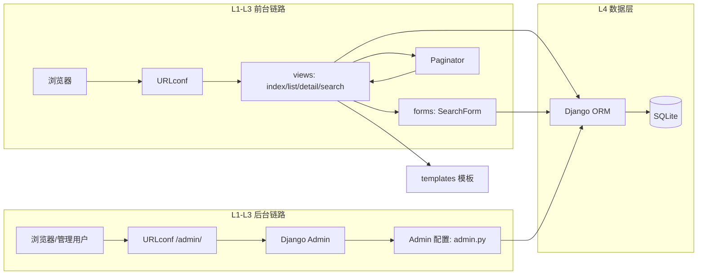

# 基于 Python/Django 的 CMS 原型系统 — 概要设计文档（V 模型）

| 项目名称 | 基于 Python/Django 的 CMS 原型系统 |
| --- | --- |
| 文档编号 | CMS-OVD-001 |
| 文档版本 | V1.0 |
| 编写日期 | 2026-08-08 |
| 编写人 | （姓名/学号占位） |
| 输入文档 | 《需求分析文档》CMS-REQ-001 V1.0 |
| 输出对象 | 《详细设计文档》CMS-DES-001（已交付）→ 编码 → 测试 |

---

## 0. 修订记录

| 版本 | 日期 | 修订说明 |
| --- | --- | --- |
| V0.1 | 2026-08-08 | 初稿 |
| V1.0 | 2026-08-08 | 评审通过 |

## 1. 引言

### 1.1 编写目的

本文档处于软件工程 **V 模型的概要设计层（左臂第 2 层）**，在《需求分析文档》与《详细设计文档》之间承上启下，回答三个问题：

1. **体系如何组织** —— 系统总体架构风格、分层与模块划分；
2. **接口如何界定** —— 模块间的依赖、调用关系与外部接口；
3. **右臂如何对齐** —— 概要设计层对应的右臂为 **系统测试**，本设计为系统测试提供测试入口与可测试性支撑。

字段级、类级、SQL 级设计**不在本文档重复**，引用《详细设计文档》CMS-DES-001。

### 1.2 范围

体系结构设计、模块分解、数据设计概要、接口设计概要、出错处理概要、安全概要、部署设计、可测试性设计、需求-模块-测试三方追踪、开发计划。

### 1.3 术语

| 术语 | 说明 |
| --- | --- |
| MVT | Django 的 Model-View-Template 模式 |
| 模块 | 可独立设计/测试/维护的代码单元（应用、文件、函数集） |
| 系统测试 | V 模型右臂第 2 层：对完整集成后的系统按需求做端到端验证 |

---

## 2. 体系结构设计

### 2.1 架构风格与总体分层

系统采用 **基于 Django MVT 的经典分层架构（4 层）**：

```
┌─────────────────────────────────────────────────────────────┐
│ L1 客户端层     浏览器（普通用户前台 / 管理用户后台 Admin）    │
├─────────────────────────────────────────────────────────────┤
│ L2 表现层       Django 模板引擎 + Bootstrap 5（HTML/CSS/JS） │
├─────────────────────────────────────────────────────────────┤
│ L3 业务逻辑层   URLconf 路由 → 视图（index/list/detail/search）│
│                 + 表单（SearchForm 校验/清洗）               │
│                 + Admin（栏目/文章 CRUD 编排）               │
├─────────────────────────────────────────────────────────────┤
│ L4 数据访问层   Django ORM（Q 对象、QuerySet、迁移、认证）    │
│                 ↓                                           │
│                 SQLite（db.sqlite3）+ migrations/           │
└─────────────────────────────────────────────────────────────┘
```

**依赖方向唯一**：上层依赖下层，禁止反向依赖；表现层仅通过视图上下文取数（不直连 ORM）。

### 2.2 体系结构视图



### 2.3 关键技术决策记录（ADR 概要）

| ADR | 决策 | 概要理由（详细论证见详细设计 D-01~D-09） |
| --- | --- | --- |
| ADR-1 | 技术栈定稿：Python 3.13 + Django 5.2 LTS + SQLite + Bootstrap 5 | 题目指定 Python/Django；LTS 保证稳定性；SQLite 零部署成本 |
| ADR-2 | 管理端复用 Django Admin | 免费完备的 CRUD + 权限；避免重复造轮子 |
| ADR-3 | 前台采用服务端渲染（SSR） | 内容型站点交互简单，GET 表单 + 回显即可；不引入前端框架 |
| ADR-4 | 前台视图用 FBV | 逻辑线性、易讲易测；复杂度由 Admin 分担 |
| ADR-5 | 查询参数统一由 Django Form 校验 | 单一校验入口，视图纯净，测试友好 |

### 2.4 质量属性实现策略（概要）

| 质量属性 | 实现策略 | 验证手段 |
| --- | --- | --- |
| 正确性 | 需求→模块→用例三层追踪 | 追踪矩阵（本文档 §10） |
| 安全性 | 默认安全（ORM 参数化/autoescape/CSRF）；权限矩阵 | T-SEC-* 安全用例 |
| 健壮性 | 表单拦截 + 分页守卫 + 业务异常捕获 | T-IT-12/14/15、T-ADM-05 |
| 可维护性 | 4 层单向依赖、模块单职责、PEP 8 + 中文注释 | ruff check |
| 性能 | publish_time 索引、分页、select_related 防 N+1 | T-PERF 采样（测试报告 §6） |
| 可测试性 | 分层独立可测、seed 命令、测试库隔离 | 测试文档 §2 |

---

## 3. 模块划分设计（概要）

### 3.1 模块划分图

```
cms_site（项目/仓库根）
├── M0 工程配置模块  config/          （settings/urls/wsgi 部署入口）
├── M1 内容业务模块  content/
│   ├── M1.1 数据模型子模块   models.py
│   ├── M1.2 查询校验子模块   forms.py
│   ├── M1.3 视图控制子模块   views.py + urls.py
│   ├── M1.4 后台配置子模块   admin.py
│   └── M1.5 种子数据子模块   management/commands/seed_data.py
├── M2 表现层模块    templates/ + static/
└── M3 测试模块      content/tests/（单元/集成/安全）
```

### 3.2 模块职责与规模预估

| 模块 | 职责 | 依赖 | 预估规模 |
| --- | --- | --- | --- |
| M0 config | 全局配置、路由挂载、部署 WSGI 入口 | Django | ≈150 行 |
| M1.1 models | Category/Item 实体、约束、方法 | django.db | ≈80 行 |
| M1.2 forms | SearchForm 字段与校验规则 | django.forms | ≈60 行 |
| M1.3 views | 4 个视图函数：编排、分页、异常分流 | M1.1/M1.2 | ≈120 行 |
| M1.4 admin | Admin 注册、列表/过滤/搜索/批量操作 | M1.1 | ≈50 行 |
| M1.5 seed | 可复现演示数据生成 | M1.1 | ≈60 行 |
| M2 templates | 5 个模板文件（base/index/list/detail/组件） | 视图上下文 | ≈200 行 |
| M3 tests | 用例实现（按 03 文档用例编号落地） | django.test | ≈300 行 |

### 3.3 模块接口（概要签名）

| 接口 | 定义 | 方向 |
| --- | --- | --- |
| `views.search(request) -> HttpResponse` | 接收 GET 参数，输出查询结果页 | M1.3 对外 |
| `SearchForm.is_valid()/cleaned_data` | 校验结果与清洗后数据 | M1.3 → M1.2 |
| `ItemManager/QuerySet` 过滤链 | `filter(title__icontains=...)` 等 | M1.3 → M1.1 → L4 |
| `paginator.page(n)` | 分页对象 | M1.3 内部 |
| `admin.site.register(CategoryAdmin, ItemAdmin)` | 后台注册 | M1.4 → M1.1 |
| `seed_data 命令` | 命令行入口 | 外部 → M1.5 |

> 详细函数级签名（参数、返回值、异常）见《详细设计文档》§7。

---

## 4. 数据设计（概要）

| 实体 | 关键属性（概要） | 关系/基数 | 存储 |
| --- | --- | --- | --- |
| Category | id, name(唯一), description, created_at | 1:N 被 Item 引用 | SQLite 表 `content_category` |
| Item | id, title, content, publish_time(索引), updated_at, is_published, author | N:1 引用 Category（RESTRICT） | SQLite 表 `content_item` |
| User | 内置 auth 模型，is_staff 判定管理角色 | 1:N 作者关系（SET_NULL） | auth_user 内置表 |

**设计要点（概要）**：
- 关系完整性由数据库外键约束保证（RESTRICT 策略——有文章的栏目禁删）；
- 查询热点 `publish_time` 建索引；模糊查询原型规模线性可接受；
- 迁移文件随模型版本化入库（Git 提交）；
- 演示数据：5 栏目 + ≥50 文章，时间覆盖 2023—2026（对应 FR-DEMO-01）。

字段级定义（类型/约束/默认值）见《详细设计文档》§5。

---

## 5. 接口设计（概要）

### 5.1 用户界面结构（页面级）

```
前台（普通用户）                        后台（管理用户）
├─ /                 首页               ├─ /admin/          登录
├─ /list/?category=  栏目文章列表        ├─ /admin/content/category/  栏目管理
├─ /item/<pk>/       文章详情            ├─ /admin/content/item/      文章管理
└─ /search/          查询（三种模式）     └─ 列表页内置 title/category/time 过滤
```

页面导航流程：首页（栏目导航 + 最新文章）⇄ 栏目列表 ⇄ 文章详情；任意页面搜索框直达查询页。

### 5.2 外部接口（HTTP）

| 方法 | URL | 入参 | 出参 | 鉴权 |
| --- | --- | --- | --- | --- |
| GET | `/` | — | 首页 HTML | 公开 |
| GET | `/list/` | category(可选) | 列表 HTML | 公开 |
| GET | `/item/<int:pk>/` | pk | 详情 HTML | 公开（草稿 404） |
| GET | `/search/` | q/start/end/category/page | 结果列表 HTML | 公开 |
| GET/POST | `/admin/**` | 表单数据 | 后台页面 | is_staff |

### 5.3 内部接口与数据流（概要）

```
浏览器 GET /search/?q=Python&category=2
  → M0 路由 → M1.3 search()
  → M1.2 校验（失败：错误回显，不落库）
  → M1.3 Q 对象组合过滤（AND） → L4 参数化 SQL
  → 分页 → M2 模板渲染（表单回显） → 200
```

---

## 6. 出错处理设计（概要）

| 错误类别 | 处理层 | 策略 | 用户可见 |
| --- | --- | --- | --- |
| 输入类错误 | M1.2 表单 | 校验失败，错误信息回显 | 表单页提示 |
| 参数类错误（页码/不存在的 pk） | M1.3 视图 | 降级（回首页/末页）或 404 | 正常页/404 页 |
| 业务类错误（删除被引用栏目） | M1.3 视图 | 捕获 ProtectedError → 提示 | Admin 提示信息 |
| 系统类错误（数据库故障） | 全局 | 不吞异常，交 Django 500 处理 + 日志 | 500 页 |
| 安全类错误（越权/CSRF） | 中间件/Admin | 拒绝访问 | 403/登录页 |

**全局错误页**：自定义 400/403/404/500 模板（`handler404` 等配置），保证错误页风格统一。

---

## 7. 安全设计（概要）

### 7.1 权限矩阵（功能 × 角色）

| 功能 | 普通用户 | 管理用户（is_staff） |
| --- | --- | --- |
| 浏览前台 / 三种查询 / 分页 | ✅ | ✅ |
| 登录后台 | ❌ | ✅ |
| 栏目增删改查 | ❌ | ✅ |
| 文章增删改查 / 状态控制 | ❌ | ✅ |
| 用户管理 | ❌ | 仅超级用户 |

### 7.2 安全控制点（概要）

| 控制点 | 手段 |
| --- | --- |
| 数据访问 | ORM 参数化（禁拼接 SQL）、Q 对象 |
| 输出 | 模板 autoescape（禁裸 `|safe`） |
| 请求 | CSRF 中间件、Cookie HttpOnly/SameSite=Lax |
| 认证 | PBKDF2、会话超时、`DEBUG=False` + 环境变量密钥（生产） |
| 业务 | 草稿对前台 404（越权不可见） |

详细配置与威胁-防御对照见《详细设计文档》§10。

---

## 8. 部署设计（概要）

| 形态 | 拓扑 | 适用 |
| --- | --- | --- |
| 开发 | `python manage.py runserver` | 本地编码调试 |
| 演示 | runserver 0.0.0.0:8000 或 Waitress（Windows 兼容 WSGI） | 助教验收/课堂演示 |
| 生产（可选） | Nginx + Gunicorn(4 workers) + SQLite/MySQL + collectstatic | 扩展部署 |

**部署关键点**：requirements.txt 锁定依赖；`migrate` → `seed_data`（或 loaddata）→ `createsuperuser` 三步初始化；环境变量注入 SECRET_KEY/DEBUG/ALLOWED_HOSTS；`STATIC_ROOT` 收集静态资源。可复现验证 = 干净环境冒烟脚本（需求 §6.2）。

---

## 9. 可测试性设计（支撑 V 模型右臂）

| 设计措施 | 支撑的测试层 |
| --- | --- |
| 分层 + 模块单职责 | 单元测试可独立构造被测对象（模型/表单不依赖视图） |
| SearchForm 独立校验 | 表单层 8 个用例无需 HTTP 环境（T-FM-*） |
| `seed_data` 命令可重复执行 | 系统测试数据可复现（T-SYS-01 幂等断言） |
| 路由命名（`name=`）统一 | 集成测试用 `reverse()` 防 URL 硬编码 |
| 视图函数保持纯 HTTP 语义 | Client 直接驱动，断言状态码/上下文/模板 |
| 日志结构化 | 缺陷定位与回归佐证 |
| 覆盖率接入（coverage/pytest-cov） | 出口准则量化（核心模块 ≥80%） |

---

## 10. 需求 — 模块 — 测试 三方追踪矩阵（概要）

| 需求编号 | 主要实现模块 | 对应测试层级 | 测试用例（见 CMS-TST-001） |
| --- | --- | --- | --- |
| FR-CAT-01~04 | M1.1 / M1.4 | 单元 + 集成 | T-MD-01/02/04, T-ADM-05 |
| FR-ART-01~05 | M1.1 / M1.4 | 单元 + 集成 | T-MD-03/06, T-ADM-02~04, T-IT-05 |
| FR-UI-01~03 | M1.3 / M2 | 集成 + 系统 | T-IT-01~03, T-SYS-02 |
| FR-SRCH-01~04 | M1.2 / M1.3 | 单元 + 集成 | T-FM-01~08, T-IT-06~12 |
| FR-PAGE-01 | M1.3 | 集成 | T-IT-13~16 |
| FR-DEMO-01/02 | M1.5 | 系统 + 验收 | T-SYS-01, T-ACC-01/02 |
| NFR-01 输入校验 | M1.2 | 单元 + 集成 | T-FM-*, T-IT-12 |
| NFR-02 安全 | M1.3/M1.4/M0 | 安全测试 | T-SEC-01~06 |
| NFR-03 性能 | M1.3 + 索引 | 系统采样 | T-PERF（测试报告 §6） |
| NFR-04/06 规范与 Git | M0~M3 | 验收 | T-ACC-06/07 |
| NFR-05 测试覆盖 | M3 | — | 出口准则（测试报告 §7） |

---

## 11. 开发与集成计划（概要里程碑）

| 里程碑 | 内容 | 对应提交（NFR-06） | 质量门 |
| --- | --- | --- | --- |
| M1 | 脚手架 + 模型 + 迁移 | commit 1-2 | ruff 通过 |
| M2 | Admin + 前台浏览页 | commit 3-4 | T-IT-01~03 通过 |
| M3 | 查询 + 分页 + 异常 | commit 5-6 | T-FM/T-IT 全通过 |
| M4 | 安全收尾 + 全局错误页 | commit 7 | T-SEC 全通过 |
| M5 | 测试全套 + seed | commit 8-9 | 全量测试绿 |
| M6 | 文档（部署/AI 说明） | commit 10 | 验收冒烟通过 |

---

## 12. 评审结论与待决问题

| 项 | 结论 |
| --- | --- |
| 架构评审 | （占位：通过 / 有条件通过） |
| 待决问题 | ① 是否引入富文本（影响安全测试范围）；② 演示账号强度策略；③ 是否启用 MySQL 切换验证 |
| 基线 | 本文档与 CMS-REQ-001 / CMS-DES-001 / CMS-TST-001 共同构成 V 模型左臂设计基线 |

---

> 下一阶段：按本概要 + 详细设计进入编码；编码完成后按《测试文档》执行，产出《测试报告》（CMS-TRP-001）。